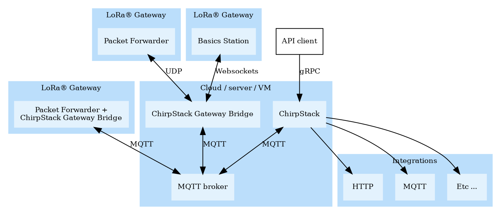

# Architecture

A typical ChirpStack deployment has the following architecture:

```dot process
digraph G {
	node [shape=record,fontsize="10"];
	edge [fontsize="10"];
	fontsize="10";

	subgraph cluster_0 {
		style=filled;
		color="#bbdefb";
		node [style=filled,color="#e3f2fd"];

		"chirpstack" -> "pub-sub" [dir="both",label="MQTT"];
		"chirpstack-gateway-bridge-cloud" -> "pub-sub" [dir="both" label="MQTT"];

		"chirpstack" [label="ChirpStack"];
		"pub-sub" [label="MQTT broker"];
		"chirpstack-gateway-bridge-cloud" [label="ChirpStack Gateway Bridge"];

		label = "Cloud / server / VM";
	}

	subgraph cluster_1 {
		style=filled;
		color="#bbdefb";
		node [style=filled,color="#e3f2fd"];
		label="LoRa&reg; Gateway";

		"chirpstack-gateway-bridge-gw" -> "pub-sub" [label="MQTT",dir="both"];
		"chirpstack-gateway-bridge-gw" [label="Packet Forwarder +\nChirpStack Gateway Bridge"];
	}


	subgraph cluster_2 {
		style=filled;
		color="#bbdefb";
		node [style=filled,color="#e3f2fd"];
		label="LoRa&reg; Gateway";

		"packet-forwarder-gw2" -> "chirpstack-gateway-bridge-cloud" [label="UDP",dir="both"];
		"packet-forwarder-gw2" [label="Packet Forwarder"];
	}

	subgraph cluster_3 {
		style=filled;
		color="#bbdefb";
		node [style=filled,color="#e3f2fd"];
		label="LoRa&reg; Gateway";

		"packet-forwarder-gw3" -> "chirpstack-gateway-bridge-cloud" [label="Websockets",dir="both"];
		"packet-forwarder-gw3" [label="Basics Station"];
	}

	subgraph cluster_5 {
		style=filled;
		color="#bbdefb";
		node [style=filled,color="#e3f2fd"];
		label="Integrations";

		"http-int" [label="HTTP"];
		"mqtt-int" [label="MQTT"];
		"other-int" [label="Etc ..."];
	}


	"chirpstack" -> "http-int";
	"chirpstack" -> "mqtt-int";
	"chirpstack" -> "other-int";

	"as-api-client" -> "chirpstack" [label="gRPC"];
	"as-api-client" [label="API client"];
}
```
