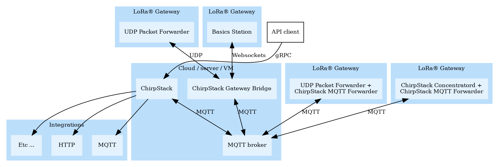
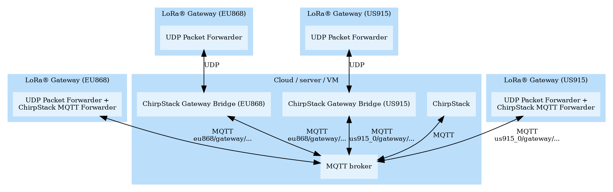
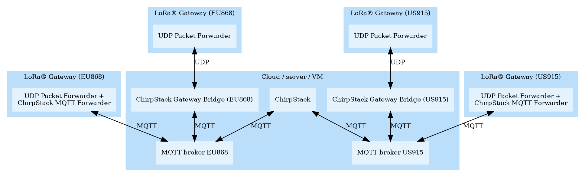

# Architecture

<!-- toc -->

A typical ChirpStack deployment has the following architecture. Note that in
this diagram, the gateways are connected in different ways to ChirpStack to
highlight the different possible connectivity options.

## Multi-region example 1

This example displays a multi-region ChirpStack installation (EU868 and US915)
using a single MQTT broker. Please note the MQTT prefix. In this case for US915
the prefix `us915_0` is used, indicating that this region uses the first 8
channels of the US915 region (the prefix is user-configurable). To keep the
diagram simple, some elements of the previous diagram have been left out.

## Multi-region example 2

As an alternative to the previous diagram, it is also possible to setup a
separate MQTT broker per region. In this it is no longer a requirement to use
the region prefix in the MQTT topic.

## ChirpStack components

### ChirpStack Concentratord

[ChirpStack Concentratord](./chirpstack-concentratord/index.md) is an
open-source LoRa concentrator daemon. It exposes a [ZeroMQ](https://zeromq.org/)
based API that can be used by one or multiple (forwarder) applications to
interact with the gateway hardware.

### ChirpStack MQTT Forwarder
[ChirpStack MQTT Forwarder](./chirpstack-mqtt-forwarder/index.md) is an
open-source Protobuf or JSON MQTT packet forwarder, which can either use
the [Semtech UDP Packet Forwarder](https://github.com/Lora-net/packet_forwarder)
or [ChirpStack Concentratord](./chirpstack-concentratord/index.md) as
gateway backend. It is intended to be installed on each gateway.

### ChirpStack Gateway Bridge

[ChirpStack Gateway Bridge](./chirpstack-gateway-bridge/index.md) is an
open-source bridge which converts messages received from the
[Semtech UDP Packet Forwarder](https://github.com/Lora-net/packet_forwarder)
or [Semtech Basics Station](https://github.com/lorabasics/basicstation)
into MQTT. It can be installed on the gateway, or in the cloud.

### ChirpStack

[ChirpStack](./chirpstack/index.md) is an open-source LoRaWAN Network Server which can be used to
to setup private or public LoRaWAN networks. ChirpStack provides a web-interface
for the management of gateways, devices and tenants as well to setup data
integrations with the major cloud providers, databases and services commonly
used for handling device data. ChirpStack provides a gRPC based API that can
be used to integrate or extend ChirpStack.
