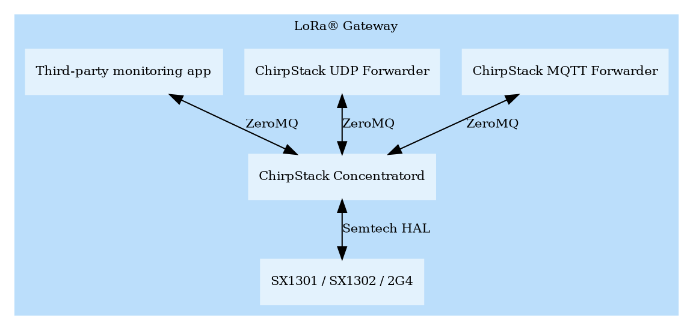

# Introduction

ChirpStack Concentratord is an open-source LoRa(WAN) concentrator daemon built
on top of the Semtech hardware abstraction layers. It exposes a [ZeroMQ](https://zeromq.org/)
based API that can be used by one or multiple applications to interact with
gateway hardware. By implementing and abstracting the the hardware specifics
in a separate daemon and exposing this over a ZeroMQ based API, packet forwarding
applications can be completely decoupled from the gateway hardware.
It also makes it possible to let multiple applications interact simultaneously
with the gateway hardware. For example multiple packet forwarders could forward
data to different LoRaWAN network servers.

## HAL support

ChirpStack Concentratord provides an unified ZeroMQ API for the following
Semtech HALs:

* [SX1301](https://github.com/Lora-net/lora_gateway)
* [SX1302/3](https://github.com/Lora-net/sx1302_hal/)
* [2g4](https://github.com/Lora-net/gateway_2g4_hal)

## Architecture example

