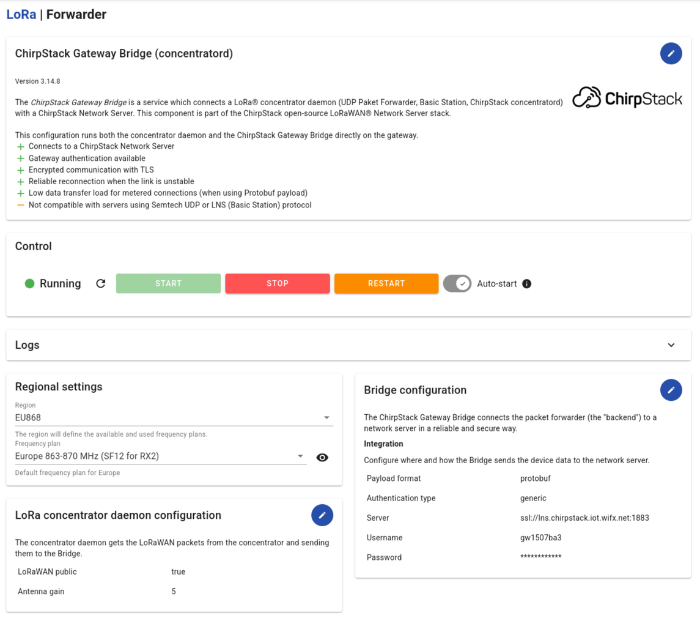

# Wifx

LORIX OS, running on Wifx gateways, provides built-in support for ChirpStack
Gateway Bridge for all Wifx gateway models.

## Gateway Compatibility

### Supported Gateways

The following Wifx gateways have native support of the ChirpStack Gateway
Bridge:

#### Wifx L1

- **Platform**: LORIX OS
- **Gateway Bridge Backend**: ChirpStack Concentratord
- **Connectivity**: Ethernet
- **Product Information**:
  [Wifx L1 product page](https://iot.wifx.net/en/products/wifx-l1/)
- **Product Documentation**:
  [Wifx L1 documentation](https://iot.wifx.net/docs/wifx-l1)

#### Wifx L1 4G

- **Platform**: LORIX OS
- **Gateway Bridge Backend**: ChirpStack Concentratord
- **Connectivity**: Ethernet + 4G/LTE cellular
- **Product Information**:
  [Wifx L1 4G product page](https://iot.wifx.net/en/products/wifx-l1-4g/)
- **Product Documentation**:
  [Wifx L1 4G documentation](https://iot.wifx.net/docs/wifx-l1-4g)

#### LORIX One

- **Platform**: LORIX OS
- **Gateway Bridge Backend**: Semtech UDP Packet Forwarder
- **Product Information**:
  [Wifx LORIX One product page](https://iot.wifx.net/en/products/lorix-one/)
- **Product Documentation**:
  [Wifx LORIX One documentation](https://iot.wifx.net/docs/lorix-one)

## Setup

Please refer to the
[ChirStack page in the LORIX OS documentation](https://iot.wifx.net/docs/lorix-os/latest/wifx-l1/user-s-guide/lorawan/lorawan-networks/chirpstack)
for more information.

## Additional Resources

- [Wifx IoT website](https://iot.wifx.net/)
- [LORIX OS Documentation](https://iot.wifx.net/docs/lorix-os/)
- [Wifx IoT Support Portal](https://iot.wifx.net/support/)
