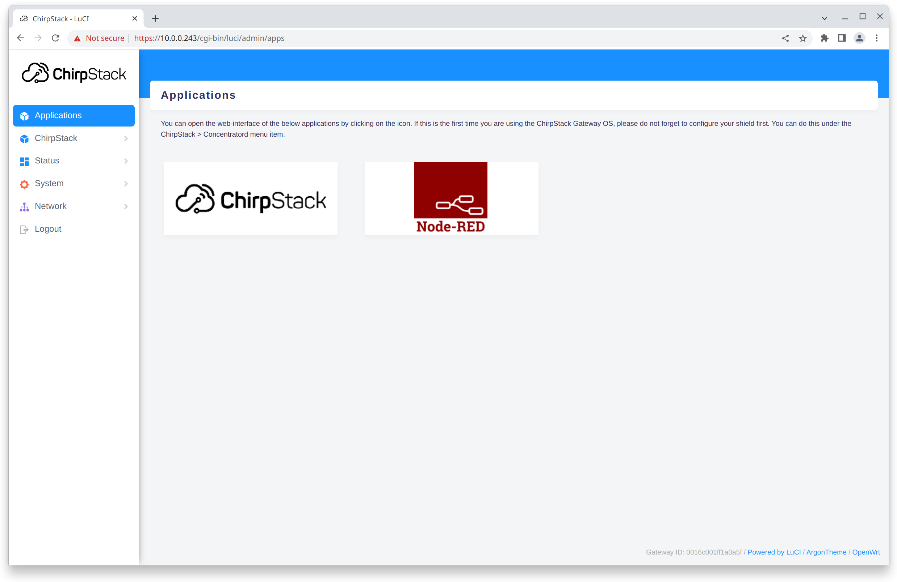

# Image types

## Raspberry Pi

### Base

The ChirpStack Gateway OS **Base** image provides all the components to use
the hardware has a LoRa&reg; gateway. This includes:

- [ChirpStack Concentratord](../chirpstack-concentratord/index.md)
- [ChirpStack MQTT Forwarder](../chirpstack-mqtt-forwarder/index.md)
- [ChirpStack UDP Forwarder](https://github.com/chirpstack/chirpstack-udp-forwarder/)

The **Base** image provides a web-interface for configuring all ChirpStack
components, network (Wi-Fi, ethernet, firewall, ...) and system settings.

### Full

The ChirpStack Gateway OS **Full** image contains everything that is included
with the **Base** image, but is also bundled with:

* [ChirpStack LoRaWAN Network Server](../chirpstack/index.md)
* *[NodeRED](https://nodered.org/)

This image is intended to provide an easy-to-setup Gateway + Network Server
solution for prototyping and testing.

## Other targets

For other targets, only a single ChirpStack Gateway OS image exists matching
the gateway architecture.
