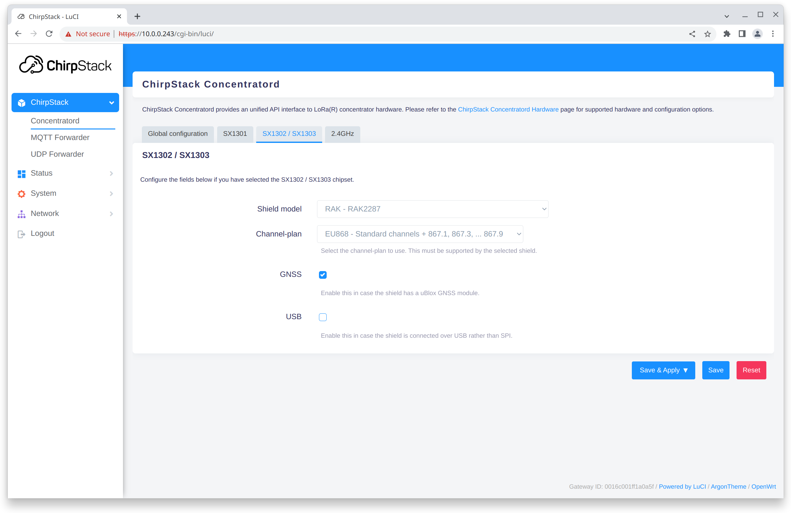

# Introduction

ChirpStack Gateway OS is an open-source [OpenWrt](https://openwrt.org/) based
embedded OS supporting Raspberry Pi and some off-the-shelf LoRa&reg;
gateways. It provides a web-interface with configuration options for most
common LoRa concentrator shields (in case of Raspberry Pi gateways).

The Raspberry Pi images come in two versions:

* **Base**: Image containing containing all gateway components
* **Full**: Base image + additional applications
    * ChirpStack Network Server
    * Node-RED

For off-the-shelf gateways only a single version is provided, capabilities
of the gateway.

