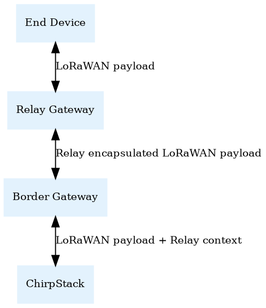

# Introduction

The ChirpStack Gateway Relay is a software component that can run on a
LoRa&reg; gateway, turning the gateway into a relay.

The aim of this component is to extend LoRaWAN&reg; coverage without
the requirement to implement a Relay protocol into the end-device
(e.g. [TS011](https://resources.lora-alliance.org/technical-specifications/ts011-1-0-0-relay)).

## Architecture

### End Device

LoRaWAN End Device, e.g. LoRaWAN 1.0.x or 1.1.x. Does not need modifications
or implementation TS011 specification.

### Relay Gateway

LoRa Gateway, e.g. SX1301/2/3 based (optionally + ISM2400 concentrator module).
This gateway does not have an internet backhaul an potentially could be solar
powered. It runs the ChirpStack Gateway Relay forwarder which handles the
relaying of uplink and downlink packages between the Relay Gateway and the
Border Gateway. For the Relay Gateway <> Border Gateway, it might use the same
radio band as the End Device, or it could use the ISM2400 band (based on
hardware capabilities + use-case requirements).

### Border Gateway

LoRa Gateway, which is internet connected. It handles the wrapping / unwrapping
of the Relay encapsulated LoRaWAN payloads. The Border Gateway <> ChirpStack
communication is as if the Border Gateway is directly communicating with the
End Device. The only exception is that on uplink it sets a `context` with Relay
specific data, which must be returned by ChirpStack on downlink.

### ChirpStack

ChirpStack will receive the uplink from the Border Gateway, with the RX
parameters from the Relay Gateway. Thus it receives the original:

* Data-rate
* Frequency
* RSSI
* SNR

Returning the uplink `context` "blob" it is able to transmit downlinks to
the End Device.