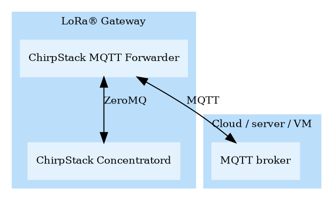
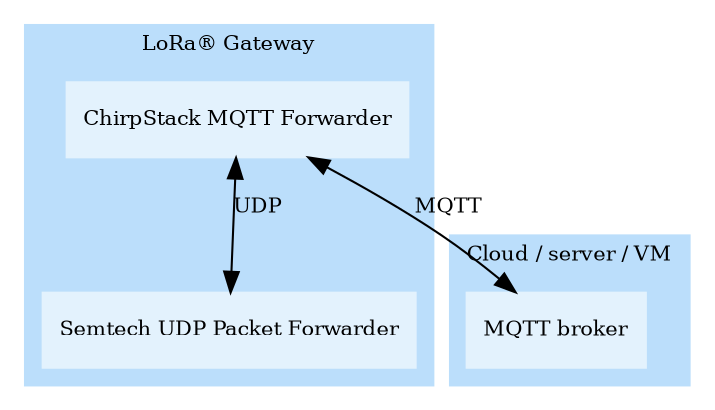

# Introduction

ChirpStack MQTT Forwarder is a MQTT packet forwarder for LoRa gateways.
By default it forwards packets in [Protobuf](https://developers.google.com/protocol-buffers)
binary format, optionally it can be configured to use JSON encoding for
debugging. In contrast to the [ChirpStack Gateway Bridge](../chirpstack-gateway-bridge/index.md),
this component must always be installed on the gateway.

## Backends

The following backends are provided:

* [ChirpStack Concentratord](../chirpstack-concentratord/index.md)
* [Semtech UDP Packet Forwarder](https://github.com/Lora-net/packet_forwarder)

### ChirpStack Concentratord

### Semtech UDP Packet Forwarder

