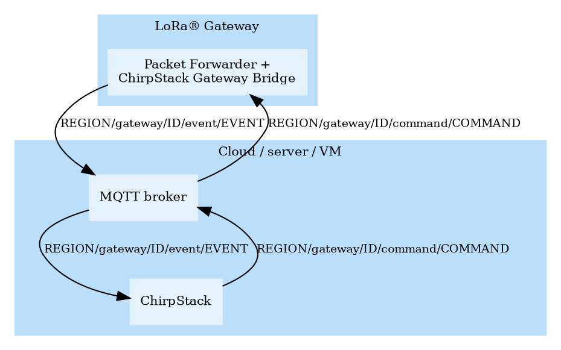

# MQTT

The MQTT backend is the default backend to communicate with the LoRa&reg;
gateways. If supported by the MQTT broker, it is recommended to make use of a
shared subscription, such that in case of multiple ChirpStack instances, each
gateway event message is delivered to only one ChirpStack instance instead of
all instances. In case this is not supported, please note that the ChirpStack
de-duplication handler will make sure that duplicates are handled correctly.

## Architecture

**Note:** In the graph above, the ChirpStack Gateway Bridge is
installed on the gateway. It is also possible to install the ChirpStack
Gateway Bridge in the cloud.
