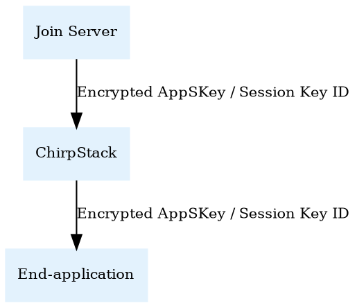

# End-to-end encryption

ChirpStack provides the possibility to implement end-to-end encryption between
the end-device and end-application. This means that ChirpStack will handle
the mac-layer and thus has access the network-session related key(s), but
it will never have access to the root-key(s) and application-session key.

Since ChirpStack does not have access to the root-key(s), this does require
an external Join Server to handle the device-activation. As well this requires
A Key Encryption Key shared between the Join Server and end-application.

## Activation

On activation, ChirpStack will forward the join-request to an external
Join Server. This Join Server will provide ChirpStack with the network-session
related key(s) and the encrypted application-session key. Note that
The network-session related key(s) might be encrypted as well, in which case
you must configure the Key Encryption Key such that ChirpStack is able to
decrypt this / these. ChirpStack will store the encrypted application-session
key in the device-session.

In the integration `join` event, ChirpStack will share the Join Server context,
which contains the session-key ID or a Key Envelope containing the encrypted
application-session key.

See also [integration.proto](https://github.com/chirpstack/chirpstack/blob/master/api/proto/integration/integration.proto#L196).

## Uplinks

On each uplink, ChirpStack will share the encrypted payload, together with the
same Join Server context field as described above.

See also [integration.proto](https://github.com/chirpstack/chirpstack/blob/master/api/proto/integration/integration.proto#L171).

## Downlinks

The end-application must encrypt the payload before enqueue. As the downlink
frame-counter is an argument of the encryption scheme, it must first query
the next downlink frame-counter by making a `GetNextFCntDown` API call
(see [device.proto](https://github.com/chirpstack/chirpstack/blob/master/api/proto/api/device.proto#L169)).

On enqueue, it must set the `f_cnt_down` and `is_encrypted` fields of the
`DeviceQueueItem`, to make ChirpStack aware that the downlink payload has
already been encrypted and which downlink frame-counter was used for encryption.

In case ChirpStack is unable to use the given downlink frame-counter (e.g.
it has already been incremented at the ChirpStack side), then ChirpStack
will generate a `log` event with an error at the time of downlink scheduling.

See also [device.proto](https://github.com/chirpstack/chirpstack/blob/master/api/proto/api/device.proto#L527).
