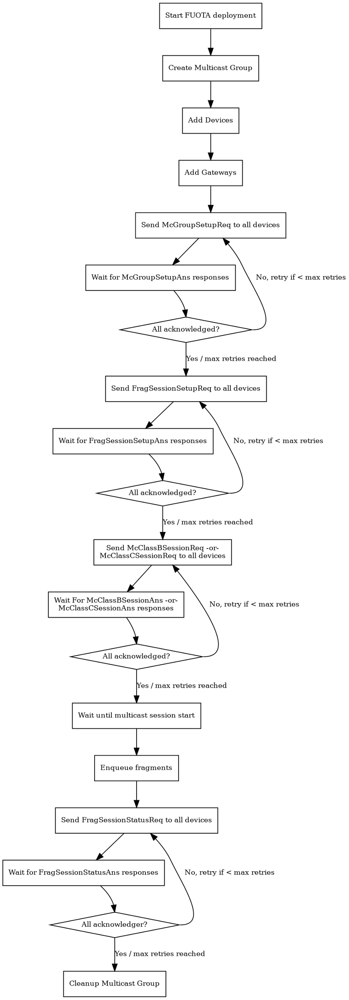

# FUOTA

Firmware update over the air (sometimes called FUOTA) makes it possible to
push firmware updates to one or multiple devices, making use of multicast.
It is standardized by the following LoRa&reg; Alliance specifications:

* LoRaWAN&reg; Application Layer Clock Synchronization (v1 & v2)
* LoRaWAN&reg; Fragmented Data Block Transport (v1 & v2)
* LoRaWAN&reg; Remote Multicast Setup (v1 & v2)

It is important to note that the implementation of this feature by devices
is optional and therefore, unless your device explicitly states that it
implements FUOTA it is safe to assume it does not.

For a step-by-step guide how to perform a FUOTA deployment, please see
the [FUOTA usage guide](../use/fuota.md).

## FUOTA flow

The following diagram provides a high-level overview of the ChirpStack
FUOTA implementation:

