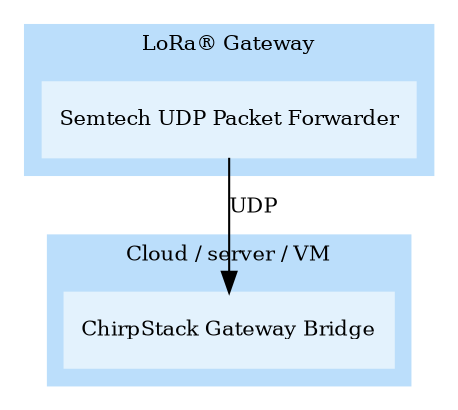
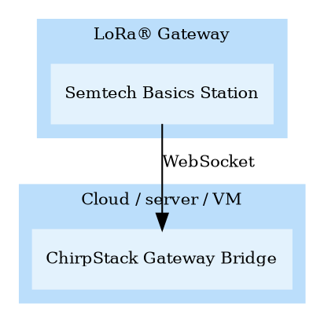

# Gateway configuration

ChirpStack is compatible with most gateways that are available. Most gateways
provide the Semtech Packet Forwarder and / or Semtech Basics Station. Some
vendors have included the ChirpStack MQTT Forwarder or ChirpStack Gateway Bridge
into their firmware. As well for some gateway models, ChirpStack provides
packages that can be installed on the gateway. In most cases, there are
different ways how you can connect your gateway to ChirpStack.

<!-- toc -->

## Per vendor / gateway configuration

If the vendor of your gateway is listed in the menu left, then please consult
that documentation page, before continuing with the generic configuration
instructions below. If the vendor or gateway is not listed, then most likely
your gateway is still compatible with ChirpStack, only we haven't documented
the steps yet. If you would like to contribute, then please consider creating
a pull-request. You will find the source of this documentation at
[https://github.com/chirpstack/chirpstack-docs](https://github.com/chirpstack/chirpstack-docs).

## Generic configuration instructions

### Gateways supporting Semtech UDP Packet Forwarder protocol

* You need to install the [ChirpStack Gateway Bridge](../chirpstack-gateway-bridge/index.md)
  on your server with the `semtech_udp` backend enabled (default configuration).
* You need to configure your gateway to forward its data to your ChirpStack
  Gateway Bridge instance. In most cases, the parameters you need to configure
  on your gateway are:
  * **Hostname**: The hostname or IP address of the server on which the ChirpStack
    Gateway Bridge is installed.
  * **Uplink & downlink port**: ChirpStack Gateway Bridge default is `1700` for both.

### Gateways supporting Basics Station Packet Forwarder protocol

* You need to install the [ChirpStack Gateway Bridge](../chirpstack-gateway-bridge/index.md)
  on your server with the `basic_station` backend enabled. Please see the
  [ChirpStack Gateway Bridge Configuration](../chirpstack-gateway-bridge/configuration.md).
  * There are three configuration options with regards to TLS and authentication:
    1. _No TLS_: In this case you leave `tls_cert`, `tls_key` and `ca_cert` empty.
	2. _Server TLS_: In this case you must configure `tls_cert` and `tls_key`.
	3. _Mutual TLS_: In this case you must configure `tls_cert`, `tls_key` and `ca_cert`.
* You need to configure your gateway such that it will connect to the ChirpStack
  Gateway Bridge (Basics Station interface).
  * At least you must configure the:
    * **Hostname**: This must point to the ChirpStack Gateway Bridge Basics Station
      listener. For the _No TLS_ option, this will be `ws://hostname:port`, e.g.
      `ws://example.com:3000` (port `3000` is the ChirpStack Gateway Bridge default).
      For the two _TLS_ options, you must use `wss://hostname:port` (note the
      `ws` vs `wss` difference). 
  * If you are using _Server TLS_ configuration in the ChirpStack Gateway Bridge,
    then you must also configure the CA certificate that has been used to sign
    the server certificate.
  * If you are using the _Mutual TLS_ configuration in the ChirpStack Gateway
    Bridge, then you must configure the CA certificate that has been sued to sign
    the server certificate, the gateway client-certificate and private key.

**Note:** If ChirpStack has been configured for this, then you can generate
per-gateway client-certificates through the ChirpStack web-interface.

### Gateways with out-of-the-box ChirpStack support

Please consult the gateway manual for instructions.

## Raspberry Pi based gateways

Please refer to the [ChirpStack Gateway OS](../chirpstack-gateway-os/index.md)
documentation.
