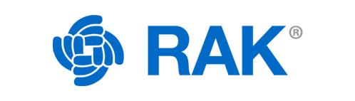
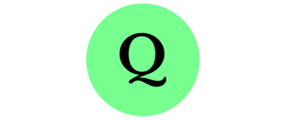
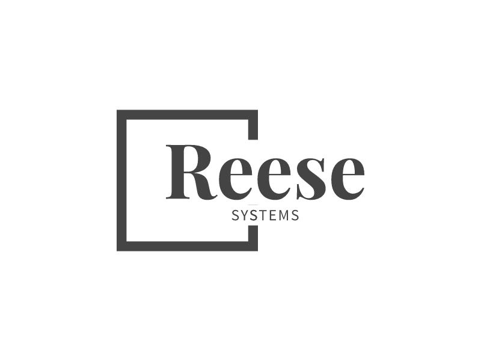
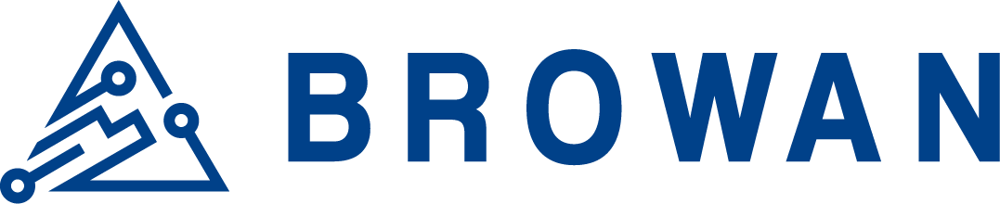
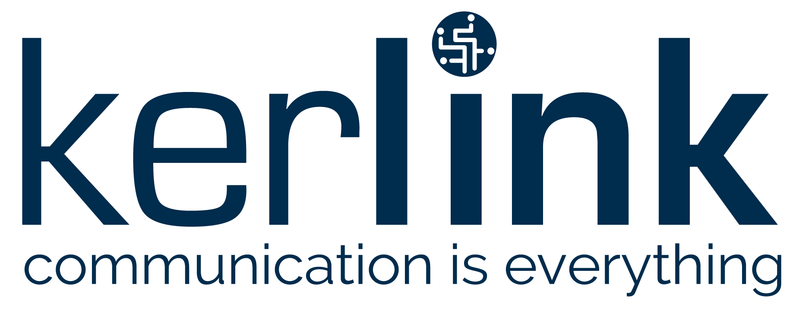
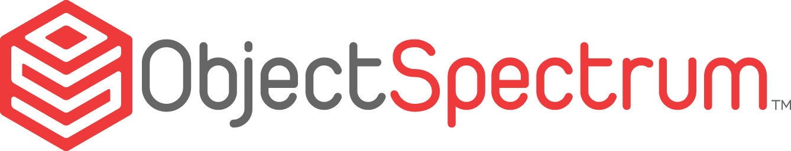

# Sponsors

## GitHub sponsors

The development of the ChirpStack is supported by the following companies
through [GitHub Sponsors](https://github.com/sponsors/chirpstack):

## Feature sponsors

The following companies have sponsored the development of one or more
significant ChirpStack feature:

